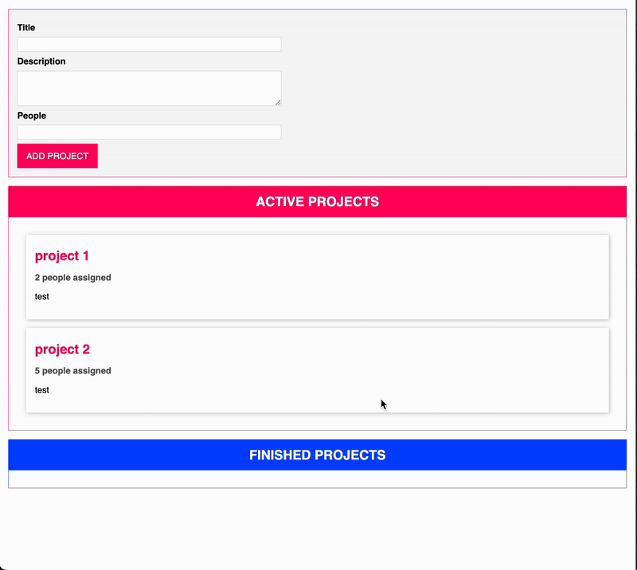

# Drag & Drop Project Management App (TypeScript)

A small **TypeScript-based project management application** demonstrating object-oriented programming principles, state management, validation, and the HTML5 Drag & Drop API.  

## Features
- Create new projects with **title, description, and people count**.
- Projects are validated before creation (required fields, length, number limits).
- Active and Finished projects displayed in **separate lists**.
- Move projects between lists using **native drag & drop**.
- Centralized project state with the **singleton pattern**.
- Reusable abstract base component for UI elements.
- **Auto-bind decorator** for event handlers.

## Tech & Concepts Used
- **TypeScript** with strict typing.
- **OOP principles**:
  - Encapsulation (`private` fields in state management).
  - Abstraction (interfaces, abstract component class).
  - Inheritance (base `Component` extended by input, list, item).
  - Polymorphism (drag & drop interfaces).
- **Design patterns**:
  - Singleton (`ProjectState`).
  - Observer (state listeners).
- **Generics** for type-safe listeners.
- **Validation utility** with flexible rules.

## Project Structure
```drag-n-drop-tasks-app
└── src/
    ├── components/         # UI components
    ├── decorators/         # Decorators
    ├── models/             # Data models & enums
    ├── state/              # State management class
    ├── util/               # Validation and utils
    └── app.ts              # App entry point & config
├── index.html              # Root HTML with templates
└── app.css                 # Basic CSS styles
```

---

## Getting Started

### 1) Clone & Install

```bash
git clone https://github.com/krisn0x/understanding-typescript.git
cd ./drag-n-drop-tasks-app
npm install
```

### 2) Run

Compile TypeScript in watch mode and serve HTML:

```bash
npm start
```

## Demo

<br>
*(Demo of creating a project; dragging a project card from **Active** to **Finished** and back again.)*

## Learning Resources

* [MDN Drag and Drop API](https://developer.mozilla.org/en-US/docs/Web/API/HTML_Drag_and_Drop_API)
* [TypeScript Handbook](https://www.typescriptlang.org/docs/handbook/intro.html)
* [SOLID Principles](https://en.wikipedia.org/wiki/SOLID) 